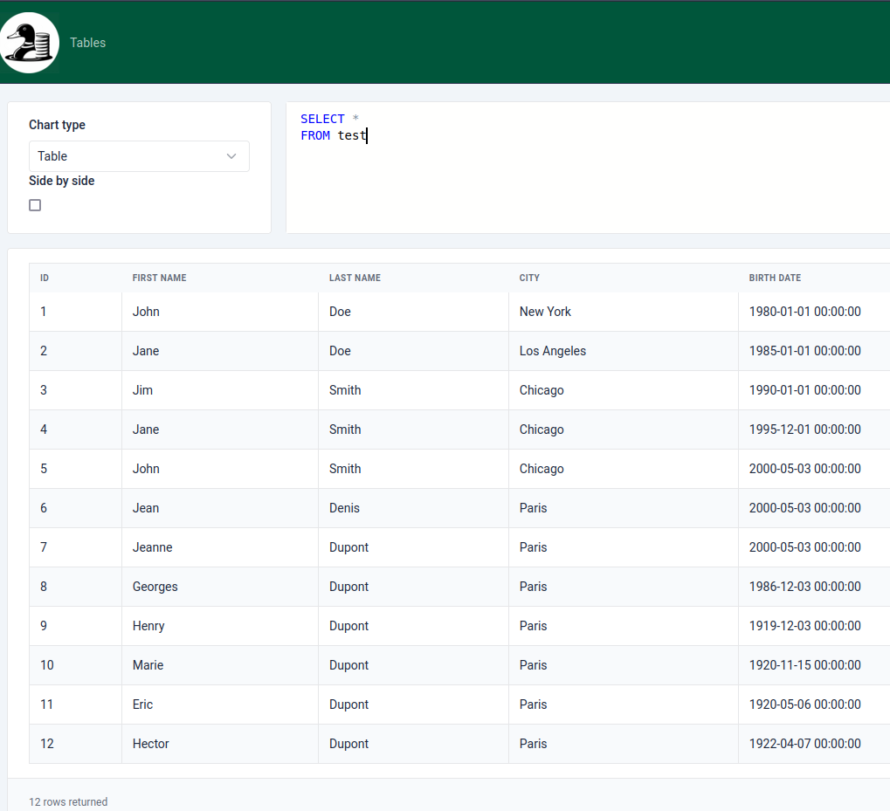
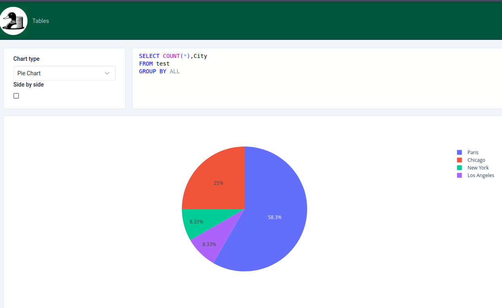

# Colvert

[](https://pypi.org/project/colvert)
[](https://pypi.org/project/colvert)


-----

**Table of Contents**

- [Colvert](#colvert)
  - [Installation](#installation)
  - [Usage](#usage)
  - [License](#license)
  - [FAQ](#faq)
    - [What does Colvert mean?](#what-does-colvert-mean)

**THIS PROJECT IS IN EARLY DEVELOPMENT**

`colvert` is a Frontend for DuckDB a fast and lightweight in-memory database designed for analytical queries. It's design to be a simple and easy to use tool for data analysis and visualization. 

It's support loading data from CSV, Parquet, and JSON files.





## Installation

We recommend installing `colvert` using `pipx`:
```console
pipx install colvert
```

Pipx is a tool to install Python applications in isolated environments. It's a great way to install Python applications without cluttering your system Python environment.

## Usage

```console
colvert  open samples/test.csv 
```

This will detect the type of the file and open it in a new browser tab.


## License

`colvert` is distributed under the terms of the Apache 2.0 license.

## FAQ

### What does Colvert mean?

Colvert is the french name for the Mallard Duck. It's a reference to DuckDB the database engine used by Colvert and the fact the author is French and born in the region of France where Mallard Duck are important.

https://en.wikipedia.org/wiki/Mallard