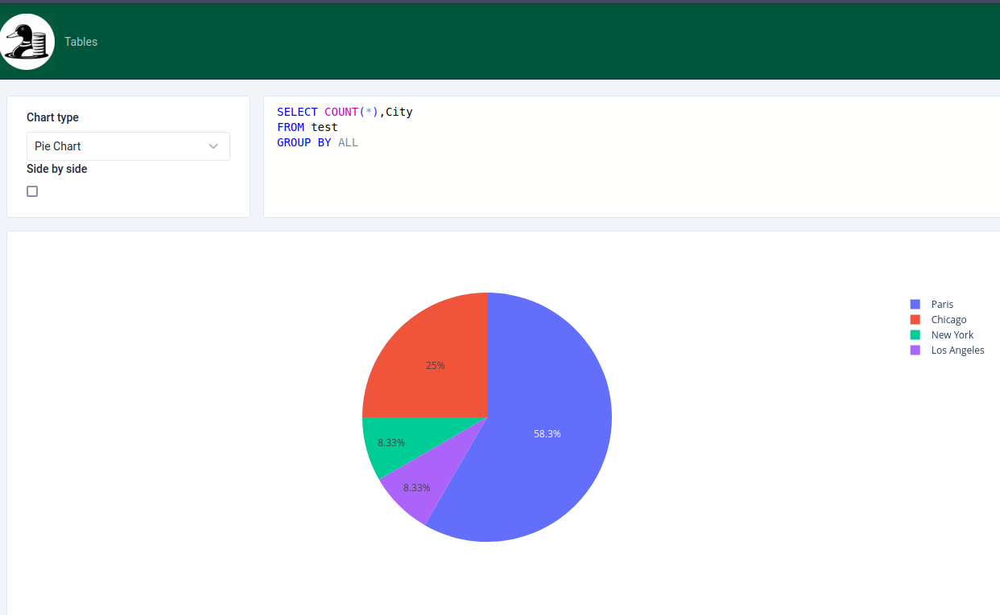
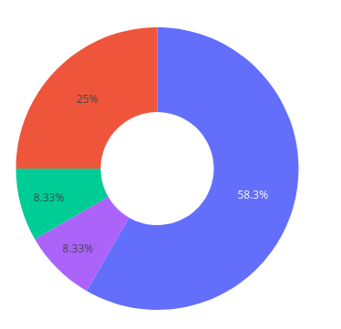

# Pie Chart

Pie Chart is a circular statistical graphic that is divided into slices to illustrate numerical proportion. In a pie chart, the arc length of each slice is proportional to the quantity it represents.

[TOC]

## Options

### Title

The `title` option allows you to set the title of the chart.

### Hole

The `hole` option allows you to create a donut chart. The value is a number between 0 and 1 that represents the size of the hole in the center of the chart.

