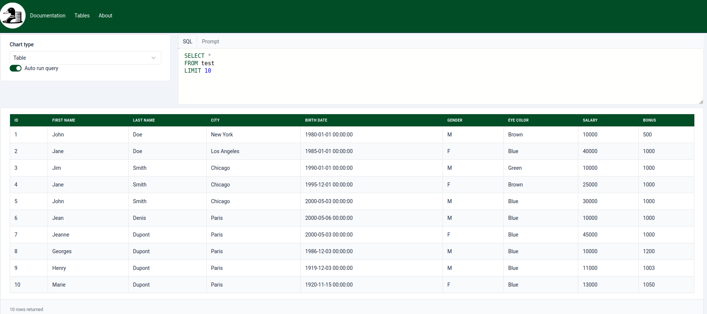

# Table

The table chart is a simple way to display data in a tabular format. The table chart is useful for displaying data that is not easily visualized in other chart types. It's the default chart type when you open a new file in Colvert.

Table charts can't be customized. If you want to order or filter the data, you can use the SQL interface.